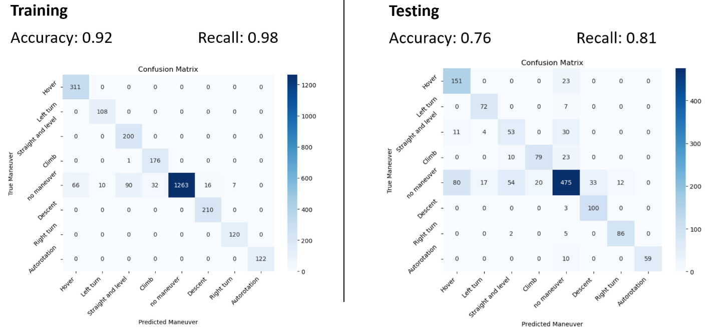

# Injmol

## Using conda env
- numpy
- pandas
- matplotlib
- statsmodels

To add further run `conda install <package>` in the activated environment then reexport the environment.yml. 
``` sh
conda activate injmol
```
### Exporting
``` sh
conda env export > environment.yml
```
### Importing / Creating
``` sh
conda env create -f environment.yml
```

## Using with ubuntu
```shell
source setup_ubuntu.sh
```

